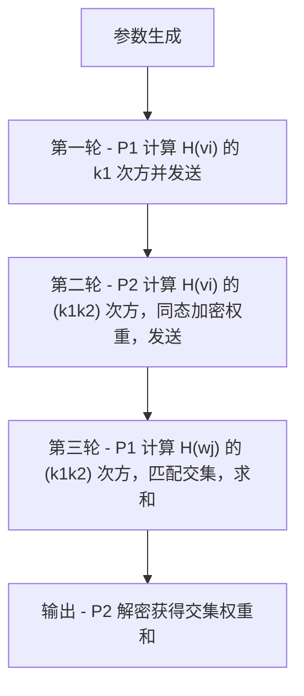

# DDH-based Private Intersection-Sum Protocol

## 协议简介

该协议允许两方在不泄露各自集合内容的前提下，安全地计算集合交集元素的权重和。这项技术可以用于密码泄露检测、隐私统计等场景。

- **P1（客户端）**：持有集合 V = {v_i}
- **P2（服务器）**：持有带权集合 W = {(w_j, t_j)}
- **目标**：P1 获得交集元素的权重和，但双方集合内容不泄露

## 数学基础与协议原理

### DDH假设
DDH（Decisional Diffie-Hellman）假设是协议安全性的基础。在循环群 G 中，给定生成元 g 和元素 $g^a$, $g^b$, $g^c$，判断 $c = ab$ 是否成立在计算上是困难的。

### Paillier同态加密
Paillier加密系统具有加法同态性质：
- 加密：$E(m) = g^m \cdot r^n \bmod n^2$
- 解密：$D(c) = ((c^\lambda \bmod n^2) - 1) / n \cdot \mu \bmod n$
- 同态性质：$E(m_1) \cdot E(m_2) = E(m_1 + m_2)$

### 协议数学描述
1. P1选择随机数 $k_1 \in Z_q$，计算 $H(v_i)^{k_1}$ 并发送给P2
2. P2选择随机数 $k_2 \in Z_q$，计算 $H(w_j)^{k_1k_2}$，并使用Paillier加密权重 $t_j$，发送给P1
3. P1计算 $H(v_i)^{k_1k_2}$，匹配交集元素，对权重密文进行同态加法运算
4. P2解密得到交集权重和

## 协议流程



## 实现思路

### 哈希函数
使用SHA-256作为哈希函数 H，将字符串映射到椭圆曲线点。为了确保哈希结果在椭圆曲线上，我们采用以下方法：
1. 计算字符串的SHA-256哈希值
2. 将哈希值解释为x坐标
3. 通过椭圆曲线方程 $y^2 = x^3 + ax + b$ 计算y坐标
4. 如果y坐标不存在，则递增x值直到找到有效的点

### 椭圆曲线运算
使用secp256k1椭圆曲线进行点运算，包括点加法和标量乘法。通过高效的二进制展开算法实现快速点乘。

### 同态加密
使用phe库实现Paillier同态加密，确保权重在传输过程中的隐私性。利用其加法同态性质，P1可以对密文进行运算而不解密。

## 依赖安装

建议使用 Python 3.7 及以上。

```bash
pip install phe pycryptodome
```

## 文件结构与用法

- `DDH_PSI_Sum_protocol.py` ：协议主实现，包含 `DDH_PSI_Sum_Homomorphic` 类及相关函数。
- `DDH_PSI_Sum.py` ：测试样例与主程序，导入协议类并运行多组典型测试。
- `requirements.txt` ：依赖包列表。

### 运行全部测试

```bash
python DDH_PSI_Sum.py
```

### 自定义测试

你可以在 `DDH_PSI_Sum.py` 中添加或修改测试用例。例如：

```python
from DDH_PSI_Sum_protocol import DDH_PSI_Sum_Homomorphic

V = ['alice', 'bob']
W = [('bob', 10), ('carol', 20)]
psi = DDH_PSI_Sum_Homomorphic()
HV_k1 = psi.P1_round1(V)
Z, pk, HWj_k2_AEnc_tj = psi.P2_round2(HV_k1, W)
S_J = psi.P1_round3(Z, HWj_k2_AEnc_tj)
intersection_sum = psi.P2_decrypt(S_J)
print(f"交集权重和: {intersection_sum}")
```

### 作为模块导入

你也可以在其他项目中导入协议类：

```python
from DDH_PSI_Sum_protocol import DDH_PSI_Sum_Homomorphic
```

## 输入输出说明

- **输入**：
    - 客户端集合 V（如 ['alice', 'bob', 'carol', 'dave']）
    - 服务器集合及权重 W（如 [('bob', 20), ('carol', 30), ('eve', 50), ('frank', 60)]）
- **输出**：
    - 交集元素（如 {'bob', 'carol'}）
    - 交集权重和（如 50）

## 参考文献

- [1] Seny Kamara, Payman Mohassel, Ben Riva. Private Set Intersection-Sum Protocol with Applications to Password Breach Statistics. [eprint.iacr.org/2019/723.pdf](https://eprint.iacr.org/2019/723.pdf)
- [Paillier同态加密库 phe](https://github.com/data61/python-paillier)
