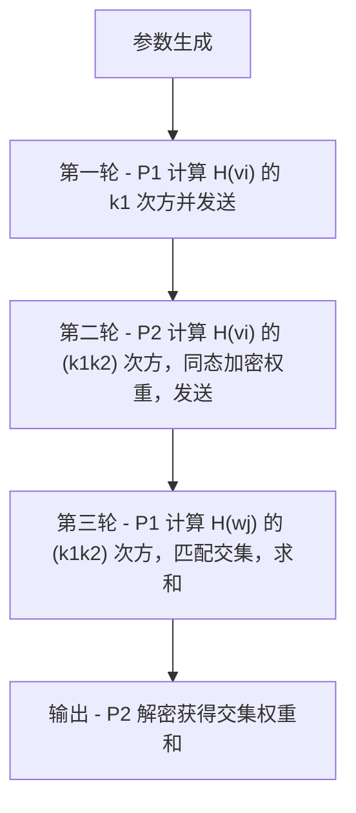

# DDH-based Private Intersection-Sum Protocol

本项目实现了论文 [Private Set Intersection-Sum Protocol with Applications to Password Breach Statistics](https://eprint.iacr.org/2019/723.pdf) 中 Figure 2 的 DDH-based Private Intersection-Sum Protocol，支持同态加密（Paillier）保护权重隐私。

---

## 协议简介

本协议允许两方在不泄露各自集合内容的前提下，安全地计算集合交集元素的权重和。广泛应用于密码泄露检测、隐私统计等场景。

- **P1（客户端）**：持有集合 V = {v_i}
- **P2（服务器）**：持有带权集合 W = {(w_j, t_j)}
- **目标**：P1 获得交集元素的权重和，但双方集合内容不泄露

---

## 协议流程图



---

## 依赖安装

建议使用 Python 3.7 及以上。

```bash
pip install phe pycryptodome
```

---

## 文件结构与用法

- `DDH_PSI_Sum_protocol.py` ：协议主实现，包含 `DDH_PSI_Sum_Homomorphic` 类及相关函数。
- `DDH_PSI_Sum.py` ：测试样例与主程序，导入协议类并运行多组典型测试。
- `requirements.txt` ：依赖包列表。

### 运行全部测试

```bash
python DDH_PSI_Sum.py
```

### 自定义测试

你可以在 `DDH_PSI_Sum.py` 中添加或修改测试用例。例如：

```python
from DDH_PSI_Sum_protocol import DDH_PSI_Sum_Homomorphic

V = ['alice', 'bob']
W = [('bob', 10), ('carol', 20)]
psi = DDH_PSI_Sum_Homomorphic()
HV_k1 = psi.P1_round1(V)
Z, pk, HWj_k2_AEnc_tj = psi.P2_round2(HV_k1, W)
S_J = psi.P1_round3(Z, HWj_k2_AEnc_tj)
intersection_sum = psi.P2_decrypt(S_J)
print(f"交集权重和: {intersection_sum}")
```

### 作为模块导入

你也可以在其他项目中导入协议类：

```python
from DDH_PSI_Sum_protocol import DDH_PSI_Sum_Homomorphic
```

---

## 输入输出说明

- **输入**：
    - 客户端集合 V（如 ['alice', 'bob', 'carol', 'dave']）
    - 服务器集合及权重 W（如 [('bob', 20), ('carol', 30), ('eve', 50), ('frank', 60)]）
- **输出**：
    - 交集元素（如 {'bob', 'carol'}）
    - 交集权重和（如 50）

---

## 参考文献

- [1] Seny Kamara, Payman Mohassel, Ben Riva. Private Set Intersection-Sum Protocol with Applications to Password Breach Statistics. [eprint.iacr.org/2019/723.pdf](https://eprint.iacr.org/2019/723.pdf)
- [Paillier同态加密库 phe](https://github.com/data61/python-paillier)

---

## 致谢

- 协议设计与伪代码参考自原论文
- Paillier同态加密实现基于 [phe](https://github.com/data61/python-paillier)