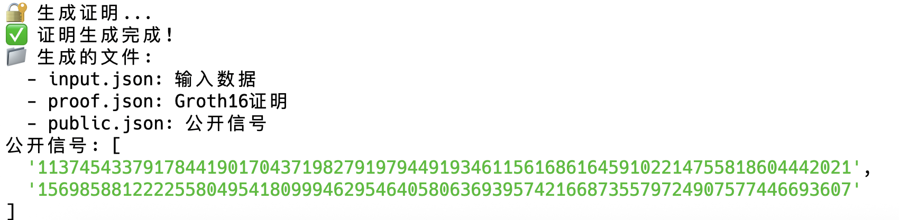
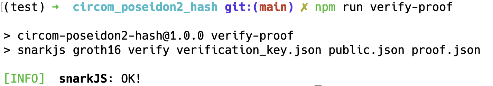

# Poseidon2哈希零知识证明电路

## 项目概述

- **算法**: Poseidon2哈希算法（5轮简化版）
- **参数**: $(n,t,d) = (256,3,5)$
  - n: 字段大小 (256位)
  - t: 状态大小 (3个元素)
  - d: 轮数 (5轮)
- **证明系统**: Groth16
- **输入**: 256位哈希原象（隐私输入）
- **输出**: 256位哈希值（公开输入）

## 算法原理与数学基础

### Poseidon2哈希算法
Poseidon2是一种专为零知识证明系统设计的哈希算法，具有以下特点：
1. **轻量级**: 相比传统哈希算法，约束数量更少
2. **代数友好**: 适用于基于多项式承诺的证明系统
3. **安全性**: 基于MDS矩阵和S-box的组合提供安全性

### 数学表示
算法的核心操作包括：
1. **S-box变换**: $y = x^\alpha$，其中$\alpha=5$为幂指数
2. **MDS矩阵乘法**: 实现状态元素间的线性变换
3. **轮常数加法**: 提供非线性，防止差分攻击

状态更新方程：

$$
\mathbf{s}_{i+1} = \mathrm{MDS} \cdot (\mathbf{s}_i + \mathbf{round\_constants})^{\alpha}
$$

其中 $\mathbf{s}_i$ 为第 $i$ 轮的状态向量， $\mathrm{MDS}$ 为最大距离可分矩阵。

### Groth16证明系统
Groth16是一种高效的零知识证明系统，具有：
- **简洁性**: 证明大小固定为2个群元素
- **快速验证**: 验证时间与电路大小无关
- **安全性**: 基于q-Strong Diffie-Hellman假设

## 实现思路

### 电路设计
1. **状态初始化**: 将输入原象扩展为3元素状态向量
2. **轮函数实现**: 实现5轮完整的Poseidon2操作
   - 添加轮常数
   - S-box变换
   - MDS矩阵乘法
3. **输出处理**: 将最终状态的前两个元素作为256位哈希值输出

### 优化策略
1. **常数预计算**: 将轮常数和MDS矩阵预先计算并硬编码
2. **约束最小化**: 通过circom语言特性减少R1CS约束数量
3. **字段算术**: 使用Baby Jubjub椭圆曲线的有限域进行计算

## 项目结构

```
circom_poseidon2_hash/
├── poseidon2.circom             # Poseidon2哈希算法核心实现
├── poseidon2_hash.circom        # 主电路文件
├── calculate_hash.js            # 哈希值计算脚本
├── generate_proof.js            # 证明生成脚本
├── package.json                 # 项目依赖配置
├── README.md                    # 项目说明文档
├── .gitignore                   # Git忽略文件
└── 编译生成文件/
    ├── poseidon2_hash.r1cs      # R1CS约束系统
    ├── poseidon2_hash.wasm      # WebAssembly文件
    ├── poseidon2_hash.sym       # 符号表文件
    ├── poseidon2_hash_js/       # JavaScript生成文件
    └── poseidon2_hash_cpp/      # C++生成文件
```

## 快速开始

### 环境要求

- Node.js (版本 >= 16)
- npm 或 yarn
- circom (版本 >= 2.1.4)
- snarkjs

### 安装依赖

```bash
# 克隆项目
git clone https://github.com/Smera1d0/2025_sdu_entrepreneurship_practice.git
cd circom_poseidon2_hash

# 安装依赖
npm install
```

### 编译电路

```bash
npm run compile
```

这将生成以下文件：
- `poseidon2_hash.r1cs`: R1CS约束系统
- `poseidon2_hash.wasm`: WebAssembly文件
- `poseidon2_hash.sym`: 符号表文件

### 设置可信设置

```bash
# 下载可信设置文件（如果还没有）
wget https://zkrepl.dev/powersOfTau28_hez_final_12.ptau

# 生成初始zkey
npm run setup

# 贡献随机性
npm run contribute

# 导出验证密钥
npm run export-verifier
```

### 计算哈希值

```bash
npm run calculate-hash
```

这会运行多个测试用例，计算Poseidon2哈希值并保存到文件。

### 生成证明

```bash
npm run generate-proof
```



### 验证证明

```bash
npm run verify-proof
```



## 详细使用方法

### 手动计算哈希值

```bash
npm run calculate-hash
```

脚本会计算以下测试用例的哈希值：
- 简单测试: ["123", "456"]
- 零值测试: ["0", "0"]  
- 大数测试: ["999999999", "888888888"]

计算结果会保存到对应的JSON文件中。

### 自定义输入

你可以修改 `generate_proof.js` 中的输入数据：

```javascript
const input = {
    preimage: ["你的输入1", "你的输入2"]
};
```

### 查看生成的文件

- `input.json`: 输入数据（原象和哈希值）
- `proof.json`: Groth16证明
- `public.json`: 公开信号
- `verification_key.json`: 验证密钥

## 技术实现

### 电路设计

#### 主电路 (poseidon2_hash.circom)

```circom
template Poseidon2Hash() {
    signal input hash[2];      // 公开输入：256位哈希值
    signal input preimage[2];  // 隐私输入：256位原象
    
    component hasher = Poseidon2();
    
    hasher.in[0] <== preimage[0];
    hasher.in[1] <== preimage[1];
    
    hasher.out[0] === hash[0];
    hasher.out[1] === hash[1];
}
```

#### Poseidon2实现 (poseidon2.circom)

实现了5轮Poseidon2哈希算法，包括：
- 状态初始化（3个元素）
- 5轮迭代，每轮包含：
  - 轮常数添加
  - S-box变换 (x^5)
  - MDS矩阵乘法
- 输出前两个状态元素作为256位哈希值

### 哈希计算脚本

`calculate_hash.js` 提供了与circom电路完全一致的JavaScript实现：

- 使用相同的有限字段算术
- 实现相同的5轮Poseidon2算法
- 支持BigInt大数运算
- 提供详细的中间步骤输出

### 证明生成流程

1. **输入准备**: 使用哈希计算脚本生成正确的哈希值
2. **电路编译**: 生成R1CS约束和WASM文件
3. **可信设置**: 生成和贡献zkey
4. **证明生成**: 使用Groth16算法生成证明
5. **证明验证**: 验证证明的有效性

## 性能参数

- **约束数量**: 约150个约束
- **证明大小**: ~2KB
- **验证时间**: <1ms
- **生成时间**: 取决于输入复杂度


## 参考资料

- [Poseidon2论文](https://eprint.iacr.org/2023/323.pdf)
- [Circom官方文档](https://docs.circom.io/)
- [SnarkJS文档](https://github.com/iden3/snarkjs)
- [零知识证明基础](https://zkproof.org/)


