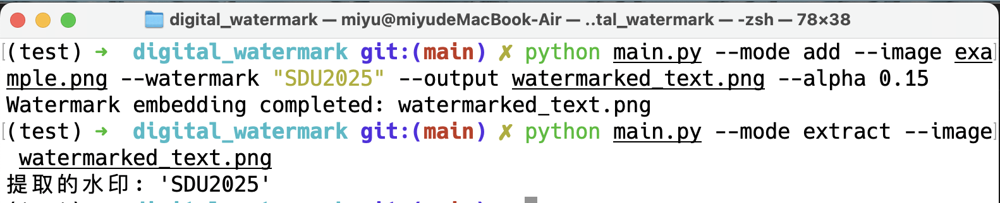
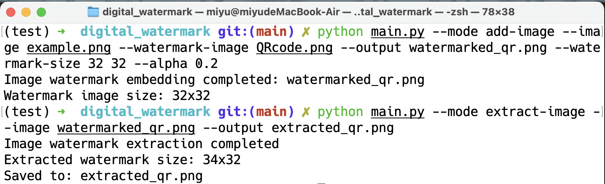
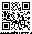
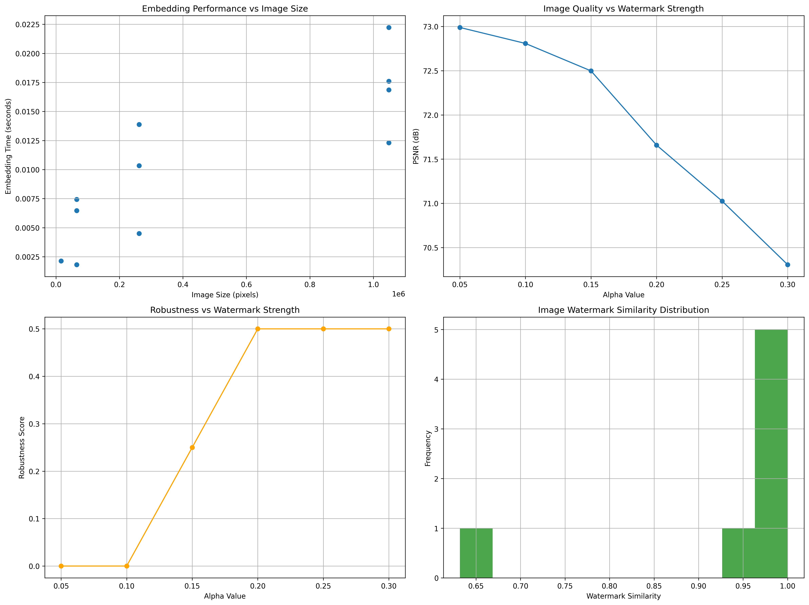

# 数字盲水印系统 (Digital Blind Watermarking System)

一个基于DCT域的先进数字水印系统，支持文字水印和图片水印，具有强大的鲁棒性测试和性能基准分析功能。

## 主要特性

### 双模式水印支持
- **文字水印**: 支持文本、版权信息的隐蔽嵌入
- **图片水印**: 支持QR码、Logo等图像水印嵌入

### 核心技术优势
- **盲水印技术**: 基于DCT（离散余弦变换）域的水印嵌入
- **盲提取**: 无需原始图像即可提取水印
- **高鲁棒性**: 对16种不同攻击类型具有抗性
- **自适应算法**: 智能的位置置乱和强度控制

### 专业分析工具
- **性能基准测试**: 多维度性能评估系统
- **可视化报告**: 自动生成详细测试图表
- **参数优化**: Alpha值影响分析和最优化建议

## 算法原理与数学基础

### DCT域水印嵌入
离散余弦变换(DCT)是一种将图像从空间域转换到频率域的技术。在DCT域中，图像的能量主要集中在低频系数上，而高频系数对视觉影响较小，适合嵌入水印信息。

DCT变换公式：
```
F(u,v) = α(u)α(v) ΣΣ f(x,y) cos[(2x+1)uπ/2N] cos[(2y+1)vπ/2N]
```
其中α(u) = √(1/N) (u=0) 或 √(2/N) (u>0)

### 水印嵌入算法
1. 将图像分块（通常为8x8像素）
2. 对每个块进行DCT变换
3. 在中频系数中嵌入水印信息
4. 使用以下公式嵌入水印：B'(i,j) = B(i,j) × (1 + α × W(k,l))
   其中B(i,j)为原始DCT系数，W(k,l)为水印信息，α为强度因子
5. 对修改后的系数进行IDCT变换得到含水印图像

### 盲提取算法
1. 对原始图像和含水印图像进行DCT变换
2. 提取中频系数
3. 使用以下公式提取水印：W(k,l) = [B'(i,j)/B(i,j) - 1]/α
4. 通过统计方法提高提取准确性

## 实现思路

### DCT实现
使用Python的scipy.fftpack库实现快速DCT变换，确保计算效率。

### 位置选择策略
1. 避免直流系数（低频）和最高频系数
2. 选择中频系数以平衡鲁棒性和不可见性
3. 使用伪随机序列确定嵌入位置，增加安全性

### 置乱技术
采用Arnold置乱算法对水印进行预处理：
```
x_{n+1} = (x_n + y_n) mod N
y_{n+1} = (x_n + 2*y_n) mod N
```
其中(x_n, y_n)为像素坐标，N为图像尺寸。

### 强度自适应
根据图像局部特性动态调整α值：
1. 计算图像块的方差
2. 方差大的区域使用较小α值
3. 方差小的区域使用较大α值

## 项目结构

```
digital_watermark/
├── main.py                    # 核心水印系统（文字+图片水印）
├── benchmark.py               # 性能基准测试系统
├── image_watermark_demo.py    # 图片水印功能演示
├── demo.py                    # 基础功能演示
├── USAGE.md                   # 详细使用说明
├── example.png                # 示例图像
├── QRcode.png                 # 示例QR码水印
└── requirements.txt           # 依赖包列表
```

## 快速开始

### 安装依赖
```bash
pip install -r requirements.txt
```

### 基础使用示例

#### 示例图片

<div align="center">
  
</div>

#### 1. 文字水印
```bash
# 添加文字水印
python main.py --mode add --image example.png --watermark "SDU2025" --output watermarked_text.png --alpha 0.15

# 提取文字水印
python main.py --mode extract --image watermarked_text.png
```

<div align="center">
  
</div>

<div align="center">
  
</div>

#### 2. 图片水印
```bash
# 添加QR码水印
python main.py --mode add-image --image example.png --watermark-image QRcode.png --output watermarked_qr.png --watermark-size 32 32 --alpha 0.2

# 提取QR码水印
python main.py --mode extract-image --image watermarked_qr.png --output extracted_qr.png
```

<div align="center">
  
</div>

<div align="center">
  
</div>

<div align="center">
  
</div>

#### 3. 完整测试与演示
```bash
# 运行完整功能测试
python main.py --mode test --watermark "SDU2025" --alpha 0.15

# 运行图片水印演示
python image_watermark_demo.py

# 运行性能基准测试
python benchmark.py --test all --watermark "SDU2025"
```



## 支持的攻击类型测试

### 几何攻击
- ✅ 水平翻转
- ✅ 垂直翻转  
- ✅ 旋转（45°、90°）
- ✅ 平移变换

### 信号处理攻击
- ✅ 亮度调整（±30%）
- ✅ 对比度调整（±50%）
- ✅ 高斯噪声添加

### 压缩攻击
- ✅ JPEG压缩（质量30-50）
- ✅ 图像缩放（0.5x-0.7x）

### 裁剪攻击
- ✅ 不同比例裁剪（60%-80%）

## 运行模式详解

### main.py 运行模式
| 模式 | 功能 | 示例命令 |
|------|------|----------|
| `add` | 添加文字水印 | `--mode add --watermark "TEXT"` |
| `extract` | 提取文字水印 | `--mode extract --watermark "TEXT"` |
| `add-image` | 添加图片水印 | `--mode add-image --watermark-image logo.png` |
| `extract-image` | 提取图片水印 | `--mode extract-image --output logo_out.png` |
| `test` | 完整鲁棒性测试 | `--mode test --watermark "TEXT"` |

### benchmark.py 测试类型
| 测试类型 | 功能 | 命令 |
|----------|------|------|
| `performance` | 文字水印性能测试 | `--test performance` |
| `image-performance` | 图片水印性能测试 | `--test image-performance` |
| `alpha` | Alpha值影响分析 | `--test alpha` |
| `robustness` | 鲁棒性基准测试 | `--test robustness` |
| `all` | 全部测试 | `--test all` |

## 性能基准与对比

### 水印类型对比

| 特性 | 文字水印 | 图片水印 |
|------|----------|----------|
| 信息容量 | 小 (几个字符) | 大 (数千像素) |
| 处理速度 | 快 (0.002-0.012s) | 中等 (0.006-0.022s) |
| 应用场景 | 版权标识、认证 | 品牌Logo、QR码 |
| 提取复杂度 | 低 | 中等 |
| 存储需求 | 低 | 高 |
| 视觉效果 | 文本信息 | 图像内容 |
| 相似度恢复 | 字符匹配 | 95-100% |

### 典型性能指标

**文字水印 (512x512图像, α=0.15)**
- 嵌入时间: ~0.004s
- PSNR: 66.37 dB
- SSIM: 1.0000
- 提取准确率: 高 (依赖alpha值)

**图片水印 (1024x1024图像, 32x32水印, α=0.2)**
- 嵌入时间: ~0.022s
- PSNR: 62.86 dB
- SSIM: 1.0000
- 水印相似度: 99.32%

## 关键参数说明

### 通用参数
- `--alpha`: 水印强度 (0.05-0.3, 默认0.1)
  - 较小值: 更好的不可感知性，较低的鲁棒性
  - 较大值: 更强的鲁棒性，可能略微影响图像质量
- `--image`: 输入图像路径
- `--output`: 输出文件路径

### 图片水印专用参数
- `--watermark-image`: 水印图像文件路径
- `--watermark-size`: 水印尺寸 [宽度 高度] (推荐16-32像素)

### 性能优化建议
- **文字水印**: 推荐 α=0.15，支持8字符以内
- **图片水印**: 推荐 α=0.2，尺寸24x24或32x32
- **图像格式**: 建议使用PNG格式避免压缩损失

## 输出文件说明

### 基本输出
- `watermarked_image.png`: 含水印的图像
- `extracted_*.png`: 提取的水印图像
- `robustness_test_results/`: 攻击测试结果图像集

### 分析报告
- `robustness_test_report.png`: 鲁棒性测试可视化报告
- `watermark_benchmark_report.png`: 性能基准分析图表
